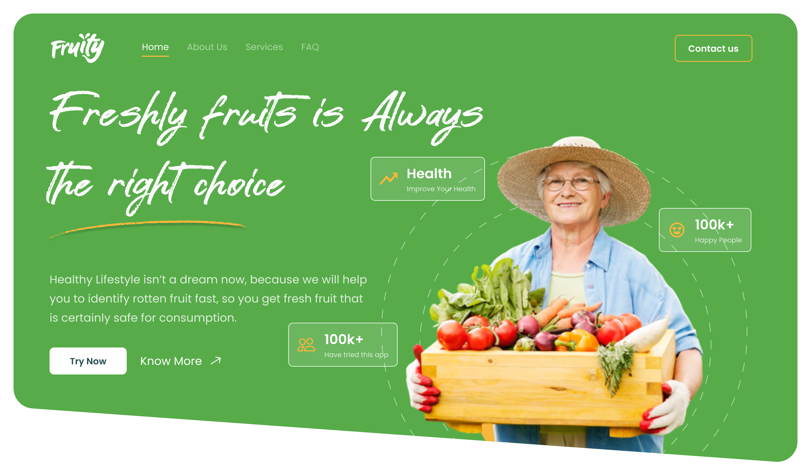

# C22-098-Fruity-Website

  &nbsp;&nbsp;
  &nbsp;&nbsp;
  &nbsp;&nbsp;
  &nbsp;&nbsp;
  &nbsp;&nbsp;

 

    

# Fruity Demo Links
#### [**Click here to view**](https://itsfruity.vercel.app/)

 

# Fruity Apps

Hortikultura merupakan sub sektor pertanian yang memiliki kontribusi penting dalam pertanian di Indonesia. Pada tahun 2020, nilai ekspor hortikultura meningkat sebesar 37,75% dibandingkan tahun 2019. Peningkatan ini didominasi oleh komoditas buah-buahan selama masa pandemi COVID-19 tahun 2020. Hal ini mengindikasikan bahwa buah-buahan memiliki tingkat permintaan yang tinggi. Penilaian mengenai kualitas buah-buahan merupakan tantangan utama di sektor pertanian.  Mengontrol kualitas eksternal buah secara manual, mungkin bisa dilakukan. Namun, akan memakan waktu lama dan berimplikasi terhadap produktivitas. Berdasarkan permasalahan diatas, kami mengusulkan sebuah sistem klasifikasi berbasis website “Fruity” untuk membantu mengidentifikasi buah busuk sebagai langkah awal untuk quality control pada komoditas buah-buahan.

1. Bahasa Pemrograman
   - HTML
   - CSS
   - JavaScript
   - Python

2. Framework/Library
   - Bootstrap
   - jQuery
   - Flask from Python

3. Library Machine Learning
   - Pandas
   - Numpy
   - Matplotlib
   - Seaborn
   - Scikit Learn
   - Tensorflow

4. Dataset
   - Lemon Quality Dataset https://www.kaggle.com/datasets/yusufemir/lemon-quality-dataset 
   - Fruits fresh and rotten for classification https://www.kaggle.com/datasets/sriramr/fruits-fresh-and-rotten-for-classification 

5. Asset
   - Pexels (https://www.pexels.com/)
   - Font Awesome (https://fontawesome.com/)
