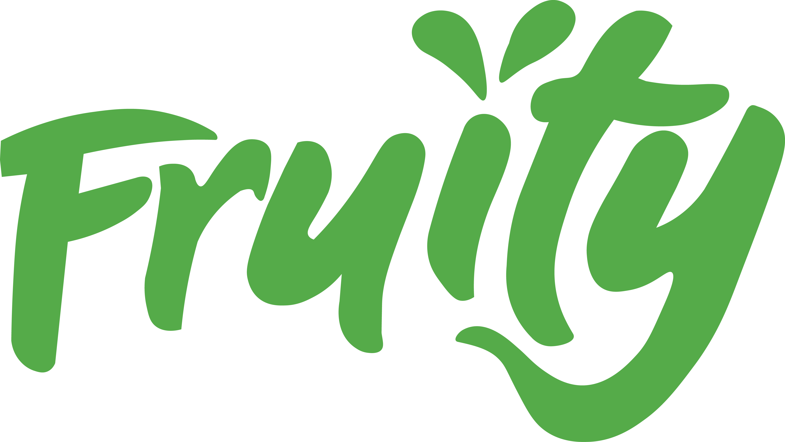
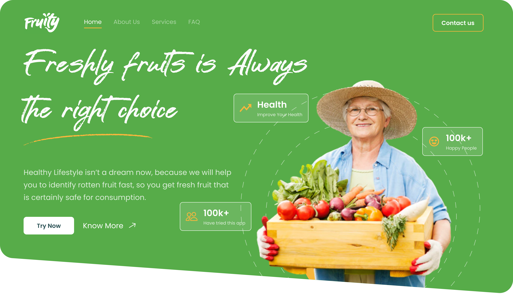
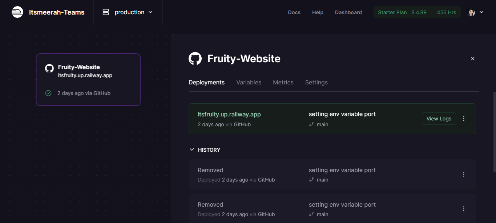

<a id="0"></a>

<p align="center">
  <a href="https://itsfruity.up.railway.app/">
 </a>
</p>

<h2 align="center">Fruity App by C22-098</h2>

<div align="center">

[](https://www.python.org/)&nbsp;&nbsp;
[](https://flask.palletsprojects.com/en/2.2.x/)&nbsp;&nbsp;
[](https://railway.app/)&nbsp;&nbsp;
[](https://www.tensorflow.org/)

</div>

---

<p align="center"> 🤖 Fruity helps you quickly identify rotten fruit, saving you the hassle of sorting to get fresh fruit.
</p><br>

<a id="1"></a>

# 🌐 Demo Link <a name = "demo"></a>

In this project, we initially used Railway as a hosting platform for our application. But Railways have limited access. **Alternatively**, you can visit **https://itsfruity.onrender.com/** if the service in https://itsfruity.up.railway.app/ is no longer available.

### [**Click here to view Fruity website**](https://itsfruity.onrender.com/)

<p align='center'>
    <a href="https://itsfruity.up.railway.app/">
    </a>
</p><br>

<a id="2"></a>

# 📝 Table of Contents

1. [Introduction](#0)
2. [Demo Link](#1)
3. [Table of Contents](#2)
4. [About Fruity](#3)
   1. [Background](#3a)
   2. [Goal & Aim](#3b)
5. [Quickstart](#4)
   1. [Built Using](#4a)
   2. [Prerequisite](#4b)
   3. [Installation & Get Started Project](#4c)
   4. [Deploy Machine Learning Model with Flask](#4d)
6. [How Does the Inference Work?](#5)
7. [Project Management Plan](#6)
8. [Project Repository Structure](#7)
9. [Project Resources](#8)
10. [Academic Paper & References](#9)
11. [Support](#10)
12. [Contributing](#11)
13. [Acknowledgments](#12)

<br>

<a id="3"></a>

# 🌿 About Fruity

**Fruity** is a website-based machine learning program which is currently under development process for the Capstone Project of ***Certified Independent Study*** of **MBKM Dicoding Cycle 3** from **Machine Learning & Front End Web Development** learning path.

<br>

<a id="3a"></a>

## 💡Background

Horticulture is an agricultural sub-sector which is important contribution to agriculture in Indonesia. In 2020, the value of horticultural exports increased by 37.75% compared to 2019. This increase was dominated by fruit commodities during the 2020 COVID-19 pandemic. This indicates that fruits have a high level of demand. Assessment of fruit quality is a major challenge in the agricultural sector. Controlling the external quality of fruit manually may be possible. However, it will take a long time and have implications for productivity. Based on the problems above, we propose a website-based classification system "Fruity" to help identify rotten fruit as a first step for quality control in fruit commodities.

<br>

<a id="3b"></a>

## 🎯 Goal & Aim

This website aims to help everyone (especially fruit growers and fruit sellers) as an utility to help identify fresh and rotten fruits by uploading the image of the fruits. This feature is expected to increase productivity in detecting defects in agricultural fruits.

<br>


<a id="4"></a>

# ⚡️ Quickstart

This section will explain the steps for installing and deploying Fruity to a web service with a short code. This process is divided into 3 parts, the first one introduction and prerequisites, the second is creating the Flask project itself, and the last is the hosting process on the platform as a service. Fyi, initially, we used Heroku. Sadly, since today (starting **November 28, 2022**), Heroku has eliminated all free services. We are using other alternative platforms, one of which is **Fly.io** and **Railway**. In the project, we use Railway. But, Railway has drawbacks, access is limited to 500 hours of use. Therefore, we're looking into how to set up Fly.io as a backup host.

<br>

<a id="4a"></a>


## 📦 Built Using

Fruity is a web-based machine learning program developed by training models using the end-to-end machine learning platform, **TensorFlow**. And then, the trained model is connected to the web server using **Flask**.

<br>

<a id="4b"></a>

## 🎨 Prerequisite

- [**Python**](https://www.python.org/), one of the top machine learning and AI programming languages.
- [**Tensorflow**](https://www.tensorflow.org/install/pip), The core open-source library to help you develop and train ML models. in this package there is **Keras**. Keras is a deep learning API written in Python, running on top of the machine learning platform TensorFlow.
- [**Flask**](https://pypi.org/project/Flask/), Flask is a web application framework written in **Python**.

<a id="4c"></a>

<br>

## ⚙️ Installation & Get Started Project

This step, steps to creating Flask project and setting up in the development environment, which is running on a local server.

### 🧵 Installation of the Project to Virtual Environment

To be able to push it into a stand-alone virtual environment, follow this step. If you have already done this, step to the next step.

1. Clone this repository

    ```bash
    $ git clone https://github.com/nurmuhimawann/C22-098-Fruity-Website.git
    ```

2. Install Python Virtual Environment

    ```bash
    $ virtualenv venv
    ```

3. Install All the Requirements Inside "requirements.txt"

    ```bash
    $ pip install -r requirements.txt
    ```

4. Create Flask App Environment Variables & Run Server

    ```bash
    $ env:FLASK_APP = "wsgi"

    $ flask run
    ```

5. Open URL referencing LocalHost in your browser

    🎉 Yeaay, Congrats. The web app is successfully running on the local server. If you want the application accessible on the internet, you must deploy this app to a web service platform. Let's go to the next step 😉.

<br>

<a id="4d"></a>

##  🚀 Deploy Machine Learning Model with Flask

### Annotation

You don't have to use both. Just choose either Fly.io or Railway.

> Click on the triangle icon to expand


<details>
<summary>
<strong style="font-size: 22px;">Fly.io</strong>
<p align='center'>
  
</p>
</summary>

<!-- Content -->

1. Install Flyctl

    On OS windows, Run the Powershell install script.

    ```bash
    $ iwr https://fly.io/install.ps1 -useb | iex
    ```

2. Login Fly.io

    If it’s your first time using Fly.io, you’ll need to sign up for an account.

    ```bash
    $ flyctl auth signup
    ```

    If you already have a Fly.io account, all you need to do is sign in with flyctl. Simply run:

    ```bash
    $ flyctl auth login
    ```

3. Configure the App for Fly

    Each Fly application needs a `fly.toml` file to tell the system how we'd like to deploy it. That file can be automatically generated.

    ```bash
    $ flyctl launch
    ```

4. Deploying to Fly

    ```bash
    $ flyctl deploy
    ```

5. Viewing the Deployed App

    You can see, the application has been assigned with a DNS hostname.

    ```bash
    $ flyctl status
    ```

6. Connecting to the App

    This will open a browser on the HTTP version of the site.

    ```bash
    $ flyctl open 
    ```

    And that’s it! This is everything, now your web application accessible on the internet. Congrats 🎉

</details>

---

<details>
<summary>
<strong style="font-size: 22px;">Railway App</strong>

<br>

<p align='center'>
  
</p>
</summary>

<br>

This is the easiest way to deploy a web application to a railway because you don't need to type commands on the CLI like Fly.io.

1. Prerequisite

    You need GitHub and Railway account. If this is your first time using [GitHub](https://github.com/) and [Railway](https://railway.app/), you will need to register both GitHub and Railway. If you already have a Github and Railway account, Make sure to connect your Railway account to GitHub.

2. Forking a GitHub Repository

    If you have this project in your repository, you can skip this step and proceed to the next step. But, if you don't have it yet, you can go to [GitHub](https://github.com/), navigate to the [nurmuhimawann/C22-098-Fruity-Website](https://github.com/nurmuhimawann/C22-098-Fruity-Website) repository. In the top-right corner of the page, click **Fork**.

3. Go to your railway dashboard and click on `New Project` Button.

4. Select the option `Deploy from GitHub repo`

5. Provide Railway app to access your GitHub repositories.

6. Soon, your project should be live.

    On your dashboard, you can see the application has been assigned with a DNS hostname.

    <p align='center'>
      
    </p>

    Every time we make changes in our repo, the app will be redeployed. And that’s it. Your project has been completely deployed on Railway and is easily available for public use! Congrats 🎉

</details>

<br>


<a id="5"></a>

# ⚛ How Does the Inference Work?

1. User **uploads an image** to web application.
2. Gets the user **input of images** from Flask pages. After that, the application checks file extension to ensure that file uploaded is an image. The uploaded image is stored at `static/user_uploads` folder.
3. App extract the image's path.
4. Load the images using **tf.keras.utils.load_img(img_path, target_size=(150, 150))**. This function is applied to load image from specified path for preparation before applying image classification. The image is resized into **150x150px** resolution.
5. Because the model can't classify images directly in the initial extension. So, the image is converted first into an **array** of integers using **tf.keras.utils.img_to_array(img)**.
6. Expand the dimension of the array in input Tensor using **tf.expand_dims(img_array, axis=0)**.
7. Use the model to predict the array's class using **fresh_rotten_model.predict(img_array)**. This function returns an array of model's confidence of each label. From the array, the index of maximum value is fetched using **np.argmax(prediction)**.
8. Cast the label of the prediction using **fresh_rotten_label(prediction)** to get the result. This integer value is converted into a string based on the **JSON labels** that matches the value. And the final result will display the predicted, such as “Fresh Apples”, "Rotten Apples" etc.

<br>


<a id="6"></a>

# 📑 Project Management Plan

- [Capstone Project Management Documents](https://unej.id/DokumenManajemenCapstoneProyekDicoding2022)

- [Project Brief Document](#)

- [Minutes of Meetings with Adviser](https://unej.id/MOMSarahSalsabila)

<br>


<a id="7"></a>

# 🗃️ Project Repository Structure

## 🗂️ Project Structure

```bash
<Main Repository>
.
├── app/                        # App Modules
│   ├── models/                 # the place where machine learning models are saved
│   │   ├── image_dir           # test image files
│   │   ├── label_dir           # json label dictionary
│   │   └── model_dir           # models hdf5
│   ├── static/                 # the place where JS,Images and CSS files are saved
│   │   ├── css                 # CSS files
│   │   ├── data                 # JSON files
│   │   ├── fonts               # Fonts files
│   │   ├── img                 # Image files
│   │   ├── js                  # Javascripts files
│   │   └── user_uploads        # Store uploaded Files by users
│   ├── templates/              # the place pages & components files are saved
│   │   ├── includes            # Page chunks, components
│   │   └── layouts             # App Layouts (the master pages)
│   └── __init__.py             # the place where flask app are initialized
│   └── application.py          # Bundle all above sections, routing and expose the Flask APP 
├── datasets                    # links datasets
├── notebooks                   # baseline models .ipynb
├── readme-assets               # Contains thumbs used in documentation (README.md)
├── .gitignore                  # Specifies file intentionally untracked files
├── Procfile                    # List of process types in an app
├── README.md                   # Information about a repository
├── requirements.txt            # Application dependencies
├── runtime.txt                 # Specify the version of Python
├── set-env.txt                 # Setting for enviroment python
└── wsgi.py                     # Start the app in development and production

```

<br>

## 💾 Project Repository & Branch

This repository is divided into a **main** and **two development branches** as follows:

- **Main Branch** (main)

  Main branch is used as an integration between **fe-development** and **ml-development**. The flask framework is used to build and integrate models with the front-end.

- **Front-End Development Branch** (fe-development)

  A branch used exclusively for front-end development. In its development, written in HTML, CSS, and JS.

- **Machine Learning Development Branch** (ml-development)

  A branch is used exclusively for machine learning development. It's written in Jupyter Notebook using most libraries like Keras and Tensorflow.

<br>


<a id="8"></a>

# 📂 Project Resources

## Progamming Languange

[](https://www.python.org/)&nbsp;&nbsp;
[](https://html.spec.whatwg.org/)&nbsp;&nbsp;
[](https://www.w3.org/Style/CSS//)&nbsp;&nbsp;
[](https://www.javascript.com/)&nbsp;&nbsp;

<br>

## Datasets:

- **Fruits Fresh & Rotten for Classifications:**

  https://www.kaggle.com/datasets/sriramr/fruits-fresh-and-rotten-for-classification/

<br>

## Framework, Library & Utility:

[](https://www.tensorflow.org/)&nbsp;&nbsp;
[](https://flask.palletsprojects.com/en/2.2.x/)&nbsp;&nbsp;
[](https://getbootstrap.com/)&nbsp;&nbsp;
[](https://jquery.com/)&nbsp;&nbsp;
[](https://code.visualstudio.com/)&nbsp;&nbsp;
[](https://git-scm.com/)&nbsp;&nbsp;
[](https://github.com/nurmuhimawann/)&nbsp;&nbsp;

- **Colaboratory Notebooks**

  https://colab.research.google.com/

- **Fly.io**

  https://fly.io/

- **Railway**

  https://railway.app/

- **Font Awesome**

  https://fontawesome.com/

- **Ionicons**

  https://ionic.io/ionicons

<br>

## Design Tools:

[](https://figma.com/)&nbsp;&nbsp;
[](https://www.adobe.com/id_en/products/photoshop/landpa.html/)&nbsp;&nbsp;
[](https://www.adobe.com/id_en/products/illustrator.html)&nbsp;&nbsp;

- **Pexels**

  https://www.pexels.com/

- **Unsplash**
  
  https://unsplash.com/


<br>

## Project Management Tools:

- **Asana**

  https://app.asana.com/

- **Project Libre**

  https://www.projectlibre.com/

<br>


<a id="9"></a>

# 📖 Academic Paper & References

- A. Kumar, R. C. Joshi, M. K. Dutta, M. Jonak and R. Burget, "Fruit-CNN: An Efficient Deep learning-based Fruit Classification and Quality Assessment for Precision Agriculture," 2021 13th International Congress on Ultra Modern Telecommunications and Control Systems and Workshops (ICUMT), 2021, pp. 60-65, doi: 10.1109/ICUMT54235.2021.9631643.
  
- Cortez, Atreyu Jasper Laxa.(2021)."Deploying Machine Learning Models Into A Website Using Flask". Accessed from https://towardsdatascience.com/deploying-machine-learning-models-into-a-website-using-flask-8582b7ce8802 on October, 23 2022 at 18.00 WIB.
  
- Kemenko Perekonomian. (2021)."Pengembangan Hortikultura Berorientasi Ekspor Tingkatkan Produktivitas, Kualitas, dan Kontinuitas Produk Hortikultura". Accessed from https://www.ekon.go.id/publikasi/detail/3358/pengembangan-hortikultura-berorientasi-ekspor-tingkatkan-produktivitas-kualitas-dan-kontinuitas-produk-hortikultura on October, 23 2022 at 18.00 WIB.

- Maulana, Febian Fitra dan Rochmawati, Naim,” Klasifikasi Citra Buah Menggunakan Convolutional Neural Network,” Journal of Informatics and Computer Science, vol. 01, no. 02 pp. 2686-2220 2019, doi: 10.26740/jinacs.v1n02.p104-108.

- Naik, Sapan & Patel, Bankim. (2017). Machine Vision based Fruit Classification and Grading - A Review. International Journal of Computer Applications. 170. 22-34. 10.5120/ijca2017914937.

- Sena, Samuel. (2017)." Pengenalan Deep Learning Part 7: Convolutional Neural Network (CNN)". Accessed from
https://medium.com/@samuelsena/pengenalan-deep-learning-part-7-convolutional-neural-network-cnn-b003b477dc94 on October, 23 2022 at 18.00 WIB.


<br>


<a id="10"></a>

# 💖 Like this project ?

Leave a ⭐ If you think this project is cool.

[Share with the world](https://twitter.com/intent/tweet?text=🌟Capstone%20Projects%20Dicoding%20by%20C22-098%0a%0aThis%20is%20one%20awesome%20machine%20learning%20project.%20If%20you%20want%20to%20take%20a%20look,%20check%20out%20the%20repo%20below👇&url=https%3A%2F%2Fgithub.com%2Fnurmuhimawann%2FC22-098-Fruity-Website%20@nurmuhimawann%20@putrinamahfudz%20@dariLailyfa_%0a%0a&hashtags=machinelearning%2Cdicoding)

<br>


<a id="11"></a>

# 👥 Contributing

### Sarah Salsabilla - Our lovely adviser

Thank you for being such an amazing advisor!  You are so understanding, kind and helpful. we very lucky to have you as our advisor teams, and you give a lot of help. A thousand words cannot express our gratitude to you. we really really appreciate you! Thanks kak.

### Nur Muhammad Himawan - Team Leader
[](https://www.instagram.com/mawann_/)&nbsp;&nbsp;
[](https://twitter.com/nurmuhimawann/)&nbsp;&nbsp;
[](https://www.linkedin.com/in/nurmuhimawann/)&nbsp;&nbsp;
[](https://github.com/nurmuhimawann/)&nbsp;&nbsp;

### Putri Nur Aini Mahfudz - Machine Learning Developer
[](https://www.instagram.com/putrinamahfudz/)&nbsp;&nbsp;
[](https://twitter.com/putrinamahfudz/)&nbsp;&nbsp;
[](https://www.linkedin.com/in/putrinamahfudz/)&nbsp;&nbsp;
[](https://github.com/putrinamahfudz/)&nbsp;&nbsp;

### Laily Farkhah Adhimah - Machine Learning Developer
[](https://www.instagram.com/laily_adhimah/)&nbsp;&nbsp;
[](https://twitter.com/dariLailyfa_/)&nbsp;&nbsp;
[](https://www.linkedin.com/in/laily-farkhah-adhimah-13b953257/)&nbsp;&nbsp;
[](https://github.com/Lailyadhimah/)&nbsp;&nbsp;

### Mohamad Ilman Huda - Front-End Web Developer
[](https://www.instagram.com/ilman_hudaa/)&nbsp;&nbsp;
[](https://www.linkedin.com/in/mohamad-ilman-huda/)&nbsp;&nbsp;
[](https://github.com/hudilman)&nbsp;&nbsp;

<br>


<a id="12"></a>

# 🎉 Acknowledgements

- Dicoding Academy
- My Supervisor - **Mr. Fahrobby Adnan, S.Kom.,MMSI**
- My Advisor - **Sarah Salsabilla**
- My Mentor - **Ahmad Sholihin**
- M05 Class
- Inspiration
- References
